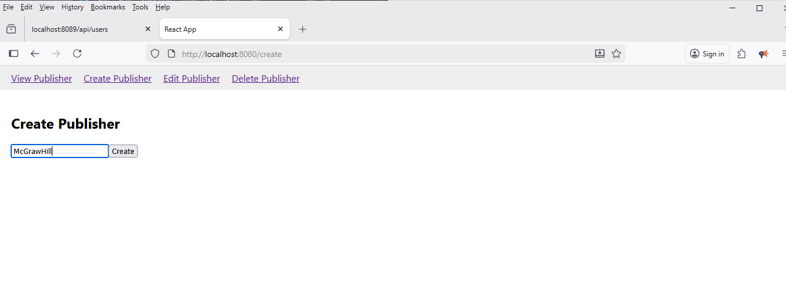
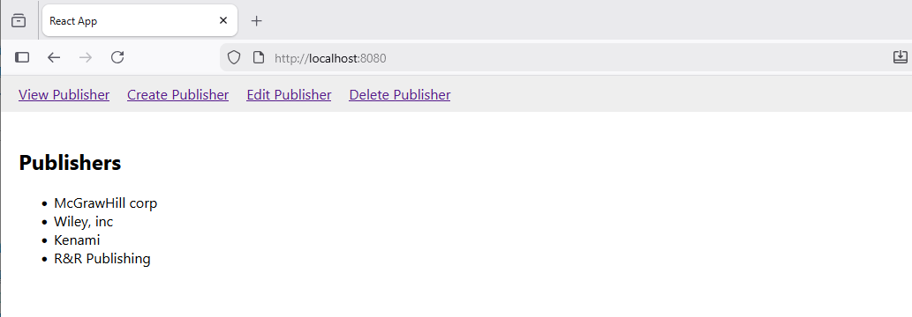

# 📚 A lightweight Publisher CRUD App

   

A full-stack **publisher Management** application with a **React frontend** and **Go backend**, demonstrating **Create, Read, Update, Delete (CRUD)** operations. The app uses Go to serve APIs and the React SPA, and supports **Dockerized deployment**.

---


## **⚡ Features**

- View all publishers  
- Create new publishers  
- Edit existing publishers  
- Delete publishers  
- React SPA with routing  
- Go REST API backend  
- Optional Docker containerization for development and production

---

## **🔗 Backend API Endpoints**

| Method | Endpoint            | Description          | Request Body Example       |
|--------|-------------------|--------------------|---------------------------|
| GET    | `/api/publishers`       | Get all publishers     | -                         |
| POST   | `/api/publishers`       | Create a publisher    | `{ "name": "New publisher" }` |
| PUT    | `/api/publishers/{id}`  | Update a publisher    | `{ "name": "Updated name" }` |
| DELETE | `/api/publishers/{id}`  | Delete a publisher    | -                         |

**Example GET Response:**

```json
[
  { "id": 1, "name": "publisher 1" },
  { "id": 2, "name": "publisher 2" }
]


| Page             | Description               |
| ---------------- | ------------------------- |
| View Publisher   | List all publishers       |
| Create Publisher | Add a new publisher       |
| Edit Publisher   | Update a publisher name |
| Delete Publisher | Remove a publisher       |

```

🚀 Running the App
1. Locally (Go + React Build)

    ```# Build frontend
    cd frontend
    npm install
    npm run build

    # Run backend
    cd ../backend
    go mod tidy
    go run *.go 
    ```

    Open browser:
    ```
    http://localhost:8080
    ```

2. Using Docker Compose
    ```
    docker-compose up --build
    ```

Backend API: http://localhost:8080/api/publishers

Frontend: http://localhost:3000


## Screenshots

Here are some screenshots showing key features of the application:

### 1. **Create Publisher Screen**

To add a publisher:




### 2. **View Publishers Screen**

To view publishers:




🛠️ <b>Technologies Used </b>

- Frontend: React, React Router, Hooks
- Backend: Go, Gorilla Mux
- Containerization: Docker, Docker Compose
- Concurrency: Go Mutex (in-memory data store)


💡 <b> Future Improvements </b>

- Dockerized deployment
- Persistent database (PostgreSQL/MySQL) instead of in-memory storage
- User authentication & authorization
- Enhanced UI with TailwindCSS or Bootstrap
- Unit & integration tests for backend and frontend
- Deployment scripts for cloud (AWS, GCP, etc.)


📄 <b> License </b>

    MIT License © 2025